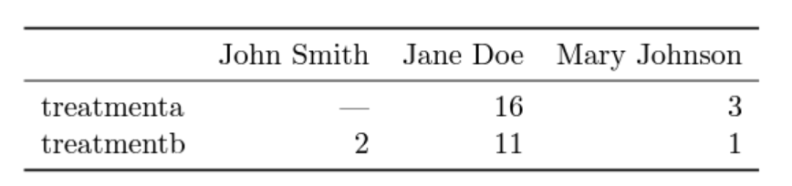
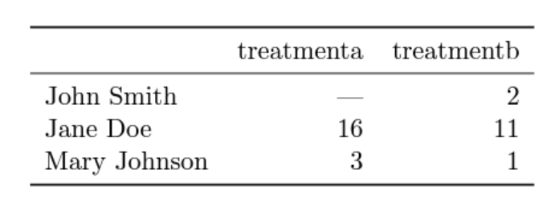
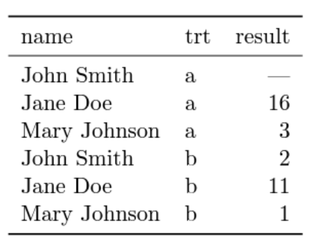
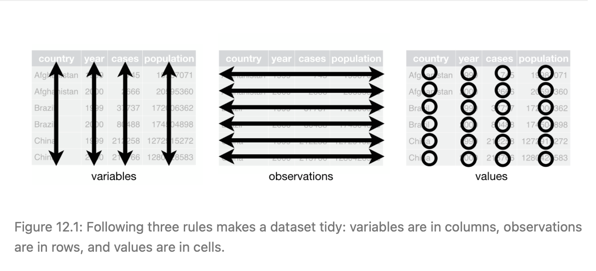
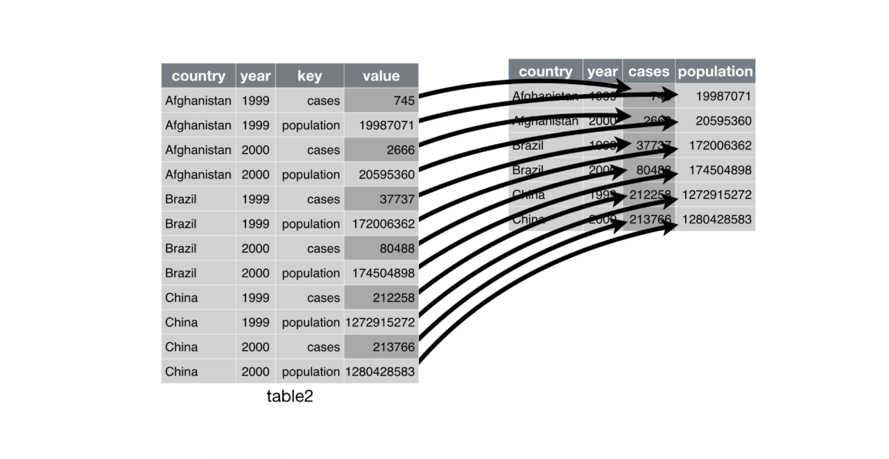
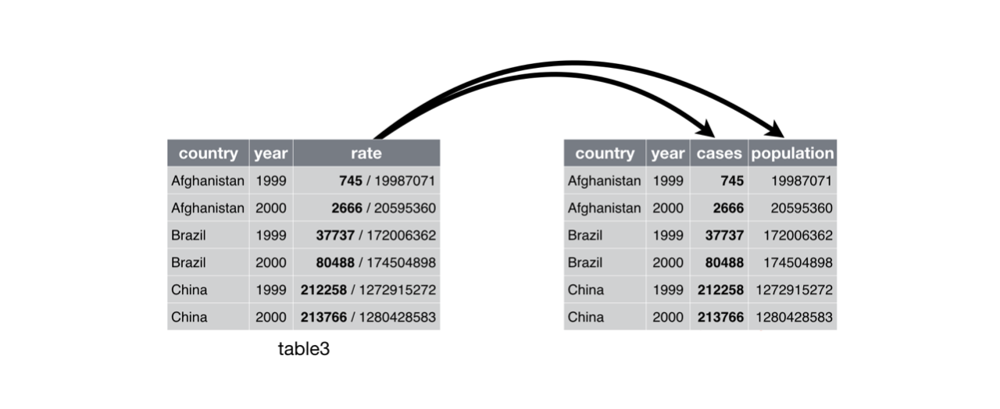

## Tidy Data

“Happy families are all alike; every unhappy family is unhappy in its own way.” –– Leo Tolstoy

“Tidy datasets are all alike, but every messy dataset is messy in its own way.” –– Hadley Wickham

* **Data tidying** is a small and important aspect of data cleaning. 
* Data Tidying: To structure datasets in a way that makes data analysis easier.
* Principles of **tidy data** provide a standard way of organizing values within a dataset.
* Principles of tidy data are related to Codd's relational databases (1990) but framed in a language familiar to Statisticians. 


## Vocabulary 

* A dataset is a collection of values, usually either numbers (if quantitative) or strings (if qualitative).
* Every value belongs to a combination of **variable** and an **observation**.

### Variable and Observation

* A variable contains all values that measure the same underlying attribute (like height, temperature, duration) across *units*.

- In data science, the word variable has a different meaning than in mathematics. 
  - In algebra, a variable is an unknown quantity. 
  - In data, a variable is known; it represents a feature that has been measured or observed. “Variable” refers to a specific quantity or quality that can vary from one case to another.
  
- Types of variables
  - quantitative : a number
  - categorical (R calls these factors): tells which category or group a case falls into
  - all non-numerical values are categorical, but not all numerical values are quantitative
    - e.g. zip code, IP address, dates 

* An observation contains all values measured on the same unit (like a person, or a day, or a race) across attributes. 
* Observations are also called **cases**

* Hard to precisely define variables and observations in general.

Identify the observations, variables and values in the example below.




## What is Tidy Data 

- Being neat is **not** what makes data tidy!


There are three interrelated rules which make a dataset tidy:

1. Each variable must have its own column.
2. Each observation/case must have its own row.
3. Each value must have its own cell.

It is your job as the researcher to define the variables, observations, and values. 

- The "tidyness" of the data set depends on the research question. It is not an inherent property to the data set itself. 
- When data are in tidy form, it’s often straightforward to transform the data into arrangements that are useful for answering interesting questions.


Example of Untidy data 



Example of Tidy Data




- Disadvantages
  - tidy data can be hard for human to quickly interpret 
  - often not the ideal form for creating graphics
- Advantages 
  - clear definitions
  - tidy data can easily be *wrangled* to a useful form for interpretation and visualization 

## Messy data
Some common problems with messy data

* Column headers are values, not variable names.

* Multiple variables are stored in one column.

* Variables are stored in both rows and columns.


## Tidy Data Example

From https://r4ds.had.co.nz/tidy-data.html 


You can represent the same underlying data in multiple ways. The example below shows the same data organised in four different ways. Each dataset shows the same values of four variables country, year, population, and cases, but each dataset organises the values in a different way.

Which ones of these is tidy? 

#### Option 1

```{r include=FALSE}
library(tidyverse)
```


```{r}
table1
```


#### Option 2

```{r}
table2
```


#### Option 3

```{r}
table3
```


#### Option 4

```{r}
table4a
table4b
```


## Example Continuted 

Table 1!



- Note that all tables contain the same information, just represented differently. Thus, we can transform Tables 2, 3, 4a/4b into Table 1, and vice versa.


### Table 2 to Table 1



### Table 3 to Table 1



### Table 4 to Table 1

Make each table tidy individually, then combine the two tables. 

(you don't need to be able to interpret this code right now, just look at the end tables along the way. )

```{r}
table4a.temp <- 
  table4a %>% 
  pivot_longer(!country, names_to = "year", values_to = "cases")
 
table4b.temp <-
  table4b %>% 
  pivot_longer(!country, names_to = "year", values_to = "population")
  
left_join(table4a.temp, table4b.temp)

```


## Code Books 

### What is a code book? 

- A **codebook** describes the contents, structure, and layout of a data collection. 
- A well-documented codebook contains information intended to be complete and self-explanatory for each variable in a data file

- https://www.icpsr.umich.edu/web/ICPSR/cms/1983 

  
## References 

- http://www.jstatsoft.org/v59/i10/paper
- https://r4ds.had.co.nz/tidy-data.html
- https://www.icpsr.umich.edu/web/ICPSR/cms/1983


