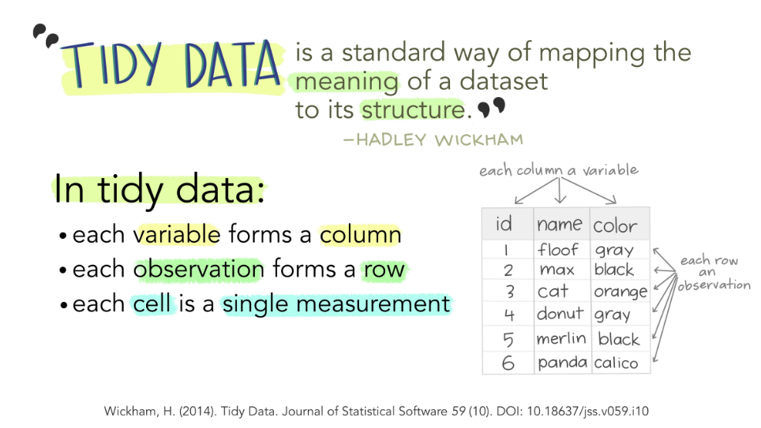
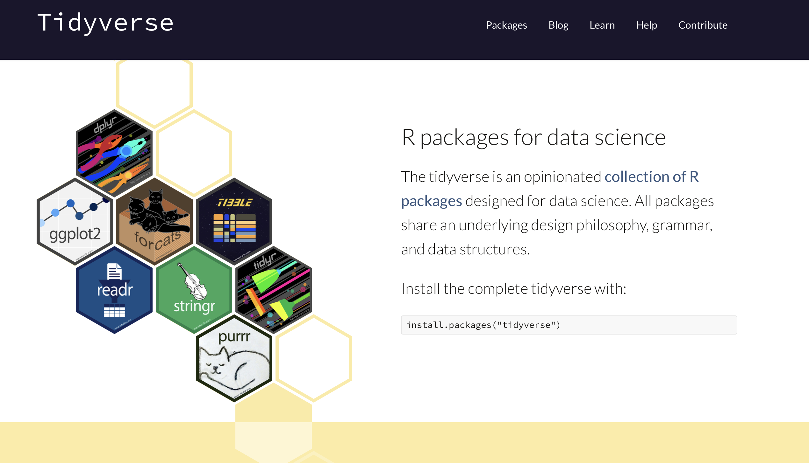

## What is tidy data?

#### Example 1
Dept. of Statistics wants to understand the effect of instructor's teaching experience on class average (out of 100) in a particular course. 

The dataset looks as follows:

| Class No.     | Instructor experience   | Class average  |
|:-------------:|:-----------------------:| :-------------:|
| 1             | low                     |     77         |
| 2             | low                     |     69         |
| 3             | high                    |     85         |
| 4             | med                     |     75         |
| 5             | high                    |     70         |
| 6             | med                     |     85         |

* Statistical studies have **independent** and **dependent** variables.
* In the example above, class average _depends_ on the instructor's experience. Hence "class average" is the dependent variable while "Class No." and "Instructor experience" are independent variables. 
* Dependent variables are also called _response variables_ and independent variables are also called _predictors_ or _explanatory variables_.
* When explanatory variables are categorical, they are also called _explanatory factors_. Hence, "Instructor experience" is a factor variable with three (ordered) levels - low, med, high.
* Each factor level is called a **treatment**. In other words, the treatment (instructor experience) is assigned to classes.
* **Unit** is the smallest object in the study on which the treatment can be applied to. In our example, each class is a unit of study.

#### Example 2
Now consider the same example, but with more than one factor variable of interest. The department wants to also understand which term is better to teach the course - fall or spring.

| Class No.     | Instructor experience   | Class average  |  Term    |
|:-------------:|:-----------------------:| :-------------:|:--------:|
| 1             | low                     |     77         |Fall      |
| 2             | low                     |     69         |Fall      |
| 3             | high                    |     85         |Spring    |
| 4             | med                     |     75         |Fall      |
| 5             | high                    |     70         |Spring    |
| 6             | med                     |     85         |Spring    |

* The variable term is (un-ordered) factor with two levels - fall and spring.
* In multi-factor studies, treatments are defined as all possible factor combinations. Here we have 6 treatments (factor level combinations) of term and instructor experience.

### Defining Tidy data
* Columns will include all variables (both independent and dependent).
* Each row corresponds to a treatment. 
  - In case of a single factor, each factor level is a treatment.
  - In case of multi-factor studies, treatments are all possible factor level combinations.
  
Important R packages like `dplyr`, `ggplot2`, `tidyverse` etc are designed to have input data frames and output data frames that are tidy.



### References for the section
1. STAT 545 notes on Tidy data and Pivoting: https://stat545.stat.ubc.ca/notes/notes-a08/
2. _Applied Linear Statistical Models_, 5th Ed, Kutner et al, McGraw-Hill/Irwin

## Tidyverse package




```{r}
library(tidyverse)
library(tibble)
```


```{r include=FALSE}
classroom <- tribble(
  ~name,    ~quiz1, ~quiz2, ~test1,
  "Billy",  NA,     "D",    "C",
  "Suzy",   "F",    NA,     NA,
  "Lionel", "B",    "C",    "B",
  "Jenny",  "A",    "A",    "B"
  )

classroom2 <- tribble(
  ~assessment, ~Billy, ~Suzy, ~Lionel, ~Jenny,
  "quiz1",     NA,     "F",   "B",     "A",
  "quiz2",     "D",    NA,    "C",     "A",
  "test1",     "C",    NA,    "B",     "B"
  )
```

We will again start with an example. Two layouts of same dataset are given below.
```{r}
classroom 
```
```{r}
classroom2
```

* What is/are the independent variable(s)?
* What is/are the dependent variable(s)?
* Mention the factors involved in the study.
* What are the treatments involved in the example?
* How should the tidy version of the data look like?

### Using `tidyverse` to tidy messy data.
Most messy data sets can be tidied with a small set of tools: `pivot_wider`, `pivot_longer`, and `separate`.

#### Messy data 1:

This dataset explores the relationship between income and religion in the US. It comes from a report produced by the Pew Research Center, an American think-tank.
```{r}
relig_income
```
* What are the independent and dependent variables involved in the study?
* What are the factors involved in the study? 
* What are the treatments?
* What does the tidy version look like?
* Does each variable have it's own column?
* Does each treatment have it's own row?
* Is the data messy?

#### `pivot_longer()`
* To pivot means to turn or rotate, like a hinge. (Source: Vocabulary.com)
* `pivot_longer()` makes datasets longer by increasing the number of rows and decreasing the number of columns.

```{r}
relig_income %>%            # dataset we want to reshape
  pivot_longer(             # we want to inc rows and dec cols
    cols = !religion,       # which cols to reshape
    names_to = "income",    # name of the var under which above col names will go
    values_to = "count"     # name of the variable for cell values
  )
```

#### Messy data 2

The billboard dataset records the billboard rank of songs in the year 2000. 
```{r}
billboard
```

```{r}
billboard %>%                    # dataset we want to reshape
  pivot_longer(                  # we want to inc rows and dec cols
    cols = starts_with("wk"),    # which cols to reshape
    names_to = "week",           # name of the var under which col names will go
    values_to = "rank",          # name of the variable for cell values
  )
```


#### `pivot_wider()`

* `pivot_wider()` is the opposite of `pivot_longer()`: it makes a dataset wider by increasing the number of columns and decreasing the number of rows. 
* It’s relatively rare to need `pivot_wider()` to make tidy data, but it’s often useful for creating summary tables for presentation, or data in a format needed by other tools.

The `fish_encounters` dataset describes when fish swimming down a river are detected by automatic monitoring stations

```{r}
fish_encounters
```

The data is in tidy format. However, many tools used to analyse this data need it in a form where each station is a column.
```{r}
fish_encounters %>%            # dataset we want to reshape
  pivot_wider(                 # we want to dec rows and inc cols
    names_from = station,      # mention the col we want to use to "widen" data
    values_from = seen         # values to fill in the cells
  )
```

#### References for the section
1. Pivoting R vignette: https://cran.r-project.org/web/packages/tidyr/vignettes/pivot.html
2. Tidy data R vignette: https://cran.r-project.org/web/packages/tidyr/vignettes/tidy-data.html


