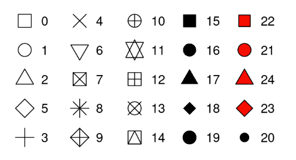

 
* R has different systems for creating graphs, but `ggplot2` is the most popular of them all.

* `ggplot2` implements the _grammar of graphics_.

Let us look at an example:

```{r}
library(ggplot2)
data("iris")

ggplot(data = iris) +  # create co-ord system i.e. empty graph
  geom_point(mapping = aes(x = Sepal.Length, y = Sepal.Width)) # layer of points
```

* The function `geom_point()` adds a layer of points to the empty plot, i.e. creates a scatter plot. 
* `ggplot2` comes with many geom functions that each add a different type of layer to a plot.
* Each geom function in `ggplot2` takes a `mapping` argument. This defines how variables in your dataset are mapped to visual properties.
* The `mapping` argument is always paired with `aes()`.

## Graphing template
A general template to make simple plots using `ggplot()` is: 
```
ggplot(data = df) + 
  geom_function(mapping = aes(...))
```
We will look at how to extend this template to make different types of graphs.

### Asthetic mappings
* An aesthetic is a visual property of the objects in your plot.
* Aesthetics include things like the size, the shape, or the color of your points. 
* We _map_ aesthetics in our plot to the variables in our data set.

E.g. In example below, we map the aesthetic `color` to the variable `Species`.


```{r}
ggplot(data = iris) +
  geom_point(mapping =aes(x = Sepal.Length, y = Sepal.Width, color = Species))
```


* `ggplot2` will automatically assign a unique _level of the aesthetic_ (E.g. a unique color) to each unique value of the variable (E.g. levels of `Species` variable), a process known as **scaling**. 
* `ggplot2` adds a legend that explains which levels correspond to which values.

In the example above, we mapped `Species` to the `color` aesthetic. Another option is to map `Species` to the `size` aesthetic.

```{r}
ggplot(data = iris) +
  geom_point(mapping =aes(x = Sepal.Length, y = Sepal.Width, size = Species))
```

* Notice that we get a warning here. That is because `Species` is a nominal categorical variable (i.e. un-ordered) while the `size` aesthetic is ordered.
* Examples of some other aesthetics are: `alpha`, `shape`
  - `alpha`: assign unique transparency level to unique variable values
  - `shape`: assign unique shape level to unique variable values

```{r}
library(gridExtra)
g1 <- ggplot(data = iris) +
          geom_point(mapping =aes(x = Sepal.Length, y = Sepal.Width, alpha = Species))
g2 <- ggplot(data = iris) +
          geom_point(mapping =aes(x = Sepal.Length, y = Sepal.Width, shape = Species))

grid.arrange(g1, g2, nrow = 2)
```

* Again, `alpha` is an ordered aesthetic while `shape` is not. 
* `ggplot2` will only use six shapes at a time. By default, additional groups will go unplotted when you use the `shape` aesthetic.
* `aes()` function will gather all aesthetic mappings of that layer and pass it onto the `mapping` argument.
* Note that x and y values (i.e. their locations) are aesthetic information about the variables that we want to map.
* Once we map aesthetics to variables, `ggplot` takes care of scaling and providing a legend.
* Although there are some default aesthetic values, we can set aesthetics as well. 

```{r}
ggplot(data = iris) +
  geom_point(mapping =aes(x = Sepal.Length, y = Sepal.Width), color = "blue")
```

* In the above plot, the color doesn’t convey information about a variable, but only changes the appearance of the plot. 

What is wrong with the code below?
```
ggplot(data = iris) +
  geom_point(mapping =aes(x = Sepal.Length, y = Sepal.Width, color = "blue"))
```

* To set an aesthetic manually, set the aesthetic by name as an argument of your geom function; i.e. it goes outside of `aes()`.

```{r}
# set size in mm
g3 <- ggplot(data = iris) +
          geom_point(mapping = aes(x = Sepal.Length, y = Sepal.Width), size = 4)
g4 <- ggplot(data = iris) +
          geom_point(mapping = aes(x = Sepal.Length, y = Sepal.Width), shape = 8)

grid.arrange(g3, g4, nrow = 2)
```

Different levels of the aesthetic `shape`:


Incorrect placing of the $+$ sign while using `ggplot()`
```
ggplot(data = iris) 
+ geom_point(mapping =aes(x = Sepal.Length, y = Sepal.Width, shape = Species))
```


### Faceting

When we have a categorical variable, it is useful to split the plot into **facets** i.e. subplots that represent a subset of the data.
 
#### Single variable: use `facet_wrap()` 

* To facet your plot by a single variable, use `facet_wrap()`.
* The variable that you pass to `facet_wrap()` should be discrete.

```{r}
ggplot(data = iris) +
  geom_point(mapping =aes(x = Sepal.Length, y = Sepal.Width, color = Species)) +
  facet_wrap(~ Species, nrow = 2) # second layer
```

#### Two variables: use `facet_grid()` 


### Geometric objects
* In R, a **geom** is the geometrical object that a plot uses to represent data. For example, bar charts use bar geom, scatter plots use point geom, etc.
* We can use different geoms to plot the same data.
* To change the geom (i.e. the geometric object) in your plot, change the geom function that you add to `ggplot()`.

```{r}
ggplot(data = iris) +
  geom_smooth(mapping =aes(x = Sepal.Length, y = Sepal.Width, color = Species)) 
```

* **Every geom function in `ggplot2` takes a mapping argument. However, not every aesthetic works with every geom.**

* We can add more than one geom on the same dataset
```{r}
ggplot(data = iris) +
  geom_smooth(mapping =aes(x = Sepal.Length, y = Sepal.Width, linetype = Species)) +
  geom_point(mapping =aes(x = Sepal.Length, y = Sepal.Width, colour = Species))
```
`group` is also an aesthetic. Unlike the color or linetype feature, it does not give each variable value a distinguishing feature.
```{r}
ggplot(data = iris) +
  geom_smooth(mapping =aes(x = Sepal.Length, y = Sepal.Width, group = Species))
```

**Mappings can be passed either locally or globally.**
```{r}
# global mapping
ggplot(data = iris, mapping =aes(x = Sepal.Length, y = Sepal.Width)) +
  geom_smooth(mapping = aes(linetype = Species)) +
  geom_point(mapping = aes(colour = Species))
```

```{r}
# local mappings
ggplot(data = iris) +
  geom_smooth(mapping =aes(x = Petal.Length, y = Petal.Width, linetype = Species)) +
  geom_point(mapping =aes(x = Sepal.Length, y = Sepal.Width, colour = Species))
```

We can specify different data for each layer.
```{r}
# define data subsets
iris_setosa = iris[iris$Species == "setosa",]
iris_versicolor = iris[iris$Species == "versicolor",]


# local mappings
ggplot() +
  geom_smooth(data = iris_setosa , mapping =aes(x = Petal.Length, y = Petal.Width, linetype = Species)) +
  geom_point(data = iris_versicolor, mapping =aes(x = Petal.Length, y = Petal.Width, colour = Species))
```

## Big picture

- Wilkinson's 2005 book *The Grammar of Graphics (2nd Ed.)* provides the principles and philosophy 
    - the `ggplot2` R package implements this framework
    - **Goal**: flexible tools for building rich, intuitive graphics


### Glyphs and Data

In archaeology, a GLYPH is a symbol or "mark" used to impart meaning:

HeiroGLYPH | Mayan GLYPH
---------------|----------------:
 |  

### Data Glyph


### A data glyph is also a "mark" on a graph, e.g. 

               

The features of a data glyph encodes the value of variables. 

- Some are very simple, e.g. a dot: 
- Some combine different elements, e.g. a pointrange: 
- Some are complicated, e.g. a dotplot: 

See: *<https://ggplot2.tidyverse.org/reference/>*


### Some Graphics Components

#### **glyph**

- The basic graphical unit often corresponding to one case.
- Other terms used include *mark* and *symbol*. 

#### **aesthetic**

- a visual property of a glyph such as position, size, shape, color, etc.  
- may be **mapped** based on data values: `sex -> color` 
- may be **set** to particular non-data related values: `color is black`

#### **scale**

* A mapping that translates data values into aesthetics.  For example,
* A scatter plot of health risks may identify cigarette smoking:  
    - <font color="blue">blue</font> represents "No"
    - <font color="red">red</font> represents "Yes"
- A printed map of campus uses a scaled representation of distance
    - a centimeter on the printed map represents 100 meters of distance on campus

#### **frame**

- The position scale describing how data are mapped to the coordinate system in use
- Quite often, the frame defines the x-axis and y-axis of a 2-dimensional cartesian plane


#### **guide**

* An indication for the human viewer of the scale.  This allows the viewer to translate aesthetics back into data values.
* For example, 
    - a legend makes explicit the meaning of Red & Blue points on the chart
    - a 1 cm length printed on a map to inform the reader that it corresponds to 100 meters on campus

### Designing Graphics

Graphics are designed by the human expert (you!) in order to reveal information that's present in the data.

#### Design choices


* What kind of glyph, e.g. scatter, density, bar, ... many others
* What variables constitute the frame. And some details:
    - axis limits
    - logarithmic axes, etc.
* What variables should be mapped to other aesthetics of the glyph.
* Whether to facet and with what variable.

More details, ..., e.g. setting of aesthetics to constants


### Good and Bad Graphics

Remember ... 

> Graphics are designed by the human expert (you!) in order to reveal information that's present in the data.

- choices depend on what information you want to convey.
- practice reading graphics and critique which ways of arranging thing are better or worse.
- A basic principle is that a graphic is about *comparison*.  Good graphics: 
    - make it easy for people to perceive things that are similar and things that are different.  
    - put the things to be compared in proximity to one another (e.g., "side-by-side") 


### Perception and Comparison

In roughly descending order of human ability to compare nearby objects:

1. Position
2. Length
3. Area
4. Angle
5. Shape (but only a very few different shapes)
6. Color

Color is the most difficult...    

  - color gradients --- we're better at
  - discrete colors --- must be carefully selected.
  - lots of people are color blind ([1 in 12 men; 1 in 200 women](http://www.colourblindawareness.org/))
  
For more, see:

Cleveland W. (1985). *The elements of graphing data*. Bell Telephone Laboratories: Murray Hill, NJ.


### Glyph-Ready Data

Glyph-ready data has this form:

  * There is one row for each glyph to be drawn. 
  * The variables in that row are mapped to aesthetics of the glyph (including position)
  * Glyph-ready data is often, but not not always, tidy data. But `tidyverse` makes it is very easy to go between the two!
  
### Exercise
Can you determine all the components on the following graph?

```
#?mtcars
data("mtcars")
library(tidyverse) # for pipe operator

mtcars %>%
  ggplot() + 
  geom_point(aes(x = hp, 
                 y = mpg, 
                 color = as.factor(carb), 
                 shape = as.factor(gear))) +
  facet_grid(~vs, 
             labeller = labeller(vs = c("0" = "V-Shaped", 
                                        "1" = "Straight"))) +
  ggtitle("Example Plot from `mtcars` Data") + 
  xlab("Gross Horsepower") + 
  ylab("Miles per Gallon") +
  scale_shape_discrete(name = "Number of Forward Gears") +
  scale_color_discrete(name = "Number of Carburetors")

```


## References
1. UBC STAT 545 course information on ggplot2: https://stat545.stat.ubc.ca/notes/notes-a06/
2. STAT 184, Summer 2023 slides on ggplot2. Content credit: Dr. Dr. Matthew Beckman

