<style type="text/css">
  body{
  font-size: 12pt;
}
</style>


# Part 1: What is Version Control?

## Introduction and motivation


Fig 1: Source - “notFinal.doc” by Jorge Cham, https://www.phdcomics.com

* **Version Control** can be thought of as a recording of your progress: you can rewind to start at the base document and play back each change you made, eventually arriving at one of your more recent versions.
* In other words, we  can "play" the different _versions_ of the document of interest i.e. version control system is a tool that keeps track of our changes, effectively creating different _versions_ of our files.
* Version control is useful, whether you are working alone or in a team.


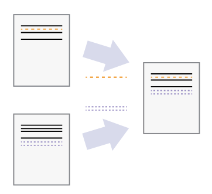

Fig 2: Let us say that two users make independent sets of changes on the same document. Unless there is a _conflict_, you can incorporate two sets of changes into the same base document.

* Version control allows us to decide which changes will be made to the next version, and keeps useful metadata about them. 
* For any part of a document, you can determine when, why, and by whom it was ever edited.
* Each person edits his or her own copy of the documents and chooses when to share those changes with the rest of the team. Thus, temporary or partial edits by one person do not interfere with another person's work.

### Summary
1. Version control is like an unlimited ‘undo’.
2. Version control also allows many people to work in parallel.

#### Git is a kind of version control system.
Some other examples of version control are Subversion, Mercurial etc. In this class, we focus on Git.


## Components of Version control
Version control uses:
- **Repository**: database of all edits or versions of your project.
- **Working copy**: A personal copy of all the files in the project. You can make arbitrary edits to this copy, without affecting your teammates.

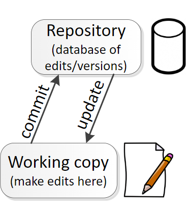

Fig 3: Repository and Working directory

* When you are happy with your edits (in your working copy), you **commit** your changes to a repository.
* You can **update** your working copy to incorporate any new edits or versions that have been added to the repository since the last time you updated.
* If different users made edits simultaneously (this is sometimes called **branching**), the the version history splits and then merges again. In the example below, Version 4 is called a *merge*.

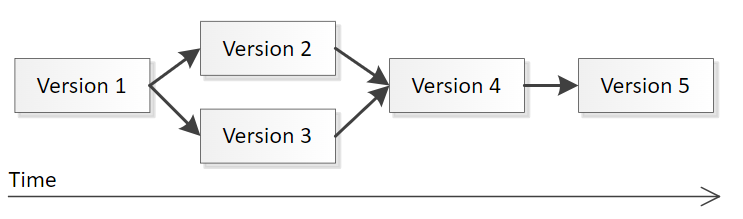


## Distributed and centralized Version Control
* There are two types of version control that mainly differ in the number of repositories:
  - Centralized version control: there is one repository
  - Distributed version control: there are multiple repositories.

* Distributed version control is more modern while centralized version control is rarely used these days. Git, the most popular version control, is a distributed version control system.

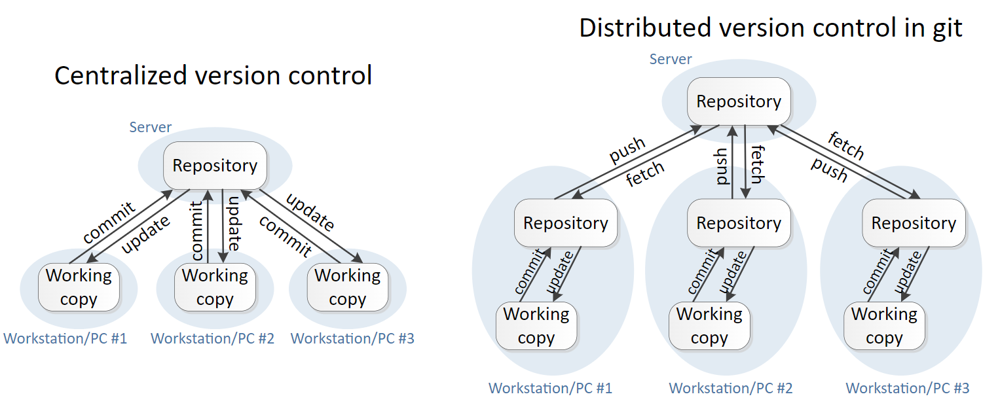

| Centralized version control | Distributed version control in git |
|:----------------------------|:-----------------------------------|
| Each user gets their own working copy, but there is <br> just one central repository | Each user gets their own repository _and_ working copy.|  
|As soon as you commit, it is possible for your <br> co-workers to update and to see your changes | - After you commit, others have no access to your changes <br> until you push your changes to the central repository <br> - When you update, you do not get others' changes unless  <br> you have first fetched those changes into your local repository|   
|For others to see your changes, two things must happen <br> - You commit <br> - They update| For others to see your changes, four things must happen: <br> - You commit <br> - You push <br> - They fetch <br> - They update  |


# Part 2: Git and GitHub
* **GitHub** is a cloud-based platform where you can store, share, and work together with others to write code. 
* GitHub is built upon Git. Git is what makes collaborative working possible while using GitHub.
* When you upload files to GitHub, you'll store them in a **Git repository**. 
* This means that when you make changes (or "commits") to your files in GitHub, Git will automatically start to track and manage your changes.
* Most people work on their files locally (on their own computer), then continually sync these local changes—and all the related Git data—with the central "remote" repository on GitHub.

There are alternatives to GitHub, like GitLab and Bitbucket, but we will be focusing only on GitHub.

# Part 3: Required set-up to get started
There are three tasks that need to be done:

**Task 1:** [Register a free GitHub account](https://happygitwithr.com/github-acct#github-acct)
**Task 2:** [Install or upgrade R and RStudio](https://happygitwithr.com/install-r-rstudio#install-r-rstudio)
**Task 3:** [Install Git](https://happygitwithr.com/install-git#install-git)

### Task 1: Create a GitHub account
I hope everyone completed Task 1 yesterday. If not, please do it now. It won't take long to create a GitHub account. Use [this link](https://happygitwithr.com/github-acct#github-acct) to find instructions and suggestions on creating a GitHub account.

### Task 2: Upgrade R and RStudio
Always try to use the most updated version of R and RStudio.

Identify the current R version you are using with the following code:
```{r}
# We can see R version in the console as soon as we start a new R session
# Other option is the command below
R.version.string
```

Right now, version 4.4.1 is the latest R version. If that is not what you are using, please follow the instructions below to upgrade your R version.

1. Go to the CRAN website.
  - For Windows Users: https://cran.r-project.org/bin/windows/base/
  - For Mac Users: https://cran.r-project.org/bin/macosx/
2. Download and run the latest R installer. This will update R.
3. Now, open/re-open RStudio.
4. Check if RStudio has detected the new updated R version. As soon a new R session starts, you should see R version information in the console. (See Fig 4) If RStudio hasn't updated to the latest R version, go to step 5.

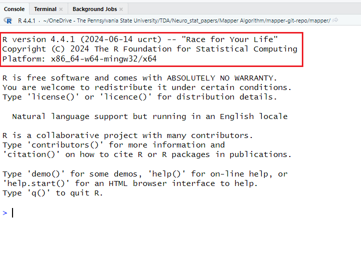

Fig 4: R version information in the console.

5. If RStudio doesn't automatically detect the latest R version, do the following: <br>
    Tools >> Global options. 

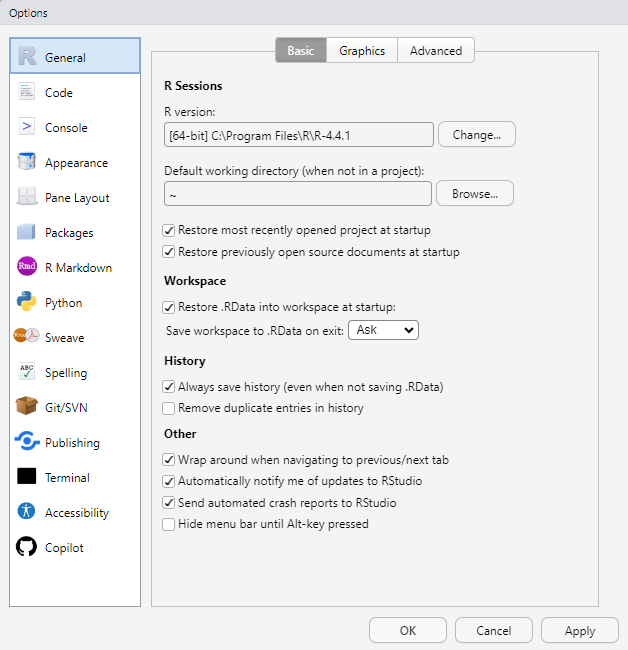 

6. Select the appropriate R version in the "R version" section of the right panel using the `change` button.
7.  After choosing the appropriate R version, click on "Apply" and then "OK" to complete the process. Restart RStudio and check if R has been updated.


### Task 3: Git installation

Note that console and Terminal are _different_. You will find the tab for terminal right next to the one for console. See Fig 5 for your reference.

1. Run the following in your **terminal** (not the usual console) to check if git is already installed on your system. 

```
which git

git --version
```

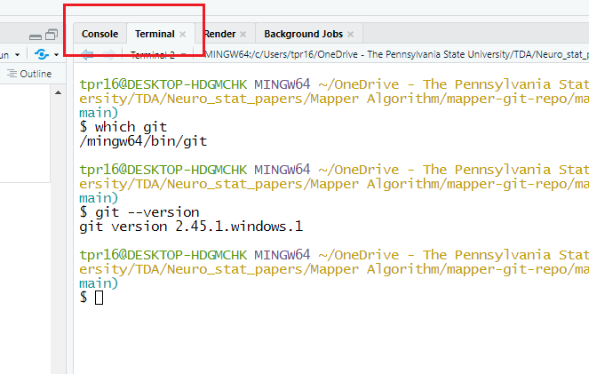

2. If Git isn't already installed, use 
    * Git Bash, if you are a Windows user: https://gitforwindows.org/ <br>
    In the future, if you need to update git on your Windows OS, run the following command in the terminal
    ```
    git update-git-for-windows
    ```
    * Install the Xcode command line tools (which includes Git) if you are a Mac user. <br>
    Run the following command in terminal to install Xcode

    ```
    xcode-select --install
    ```
3. Next step is to set up your Git username and email. We use `usethis` R package for this step. Run the following code in your _console_.          Mention the email associated with the GitHub account.
  ```
  ## install.packages("usethis")

  library(usethis)
  use_git_config(user.name = "Jane Doe", user.email = "jane@example.org")
  git_vaccinate()
  git_sitrep()
  ```
4. Our next step is to ensure we can compute with the remote server (GitHub) from the local computer. Moreover, credentials are required in this process to make sure that we are the specific GitHub user who has the access to do the task we are trying to do. 
  \textbf{Option 1:}

  * Git can communicate with a remote server using one of two protocols, HTTPS or SSH, and the different protocols use different credentials.
  * Unless there is a specific reason to choose the SSH route, everyone is recommended to follow the credential set up for HTTPS protocol.
  * With HTTPS, we will use a **personal access token (PAT)**. 
    - Settings >> Developer settings >> Personal access tokens
    - Before clicking “Generate token”, it is recommended to select the scopes "repo", "user", "gist" and "workflow".
    - Click on "Generate token"
  * GitHub encourages the use of perishable tokens, with a default Expiration period of 30 days. GitHub’s security team probably has good         reasons for their recommendation.
  * **You won’t be able to see this token again, so don’t close or navigate away from this browser window until you store the PAT locally.**

  \textbf{Option 2:}
  Use the R package `usethis`to create a token:
  ```
  usethis::create_github_token()
  ```
\textbf{NOTE:} For a more detailed description of PAT, see Chapter 9 of textbook "Happy Git and GitHub for the useR". 

# Part 4: Connecting R, RStudio and Git 
There are three things we will learn how to do. Remember that sometimes you might be asked for a password while following the instructions below. In that case, please provide your PAT token that you copied.

### Task 1: Creating a new repository on GitHub
1. Log in to your GitHub account and go to your profile page. Check for the `Repositories` tab once you go to your profile page.

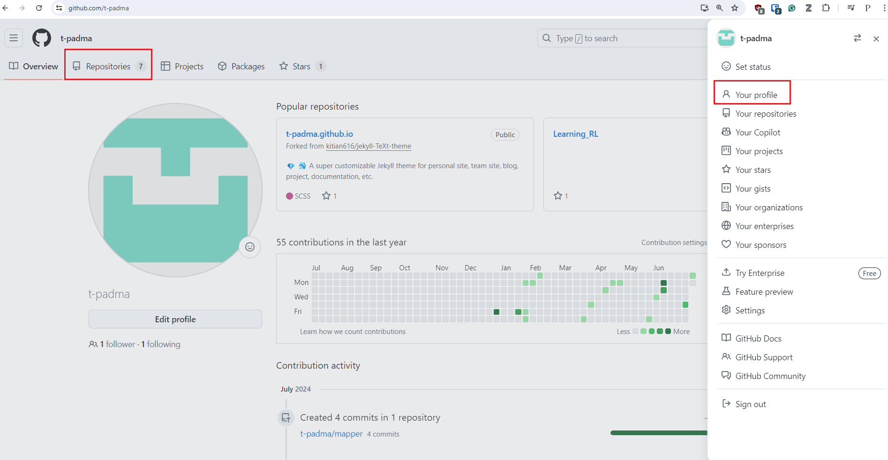

2. Click on "New" icon you see at the top right corner. Once you click on "New", you should see the page below:
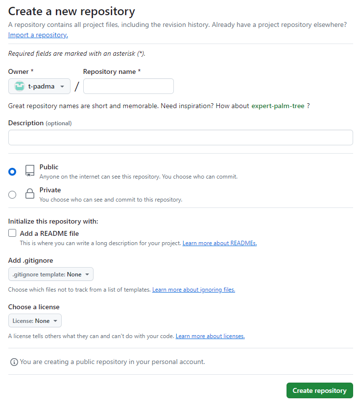

  - Provide a name for your repository without using spaces. Let's say we named it `new-repo`. 
  - Under description, mention a brief purpose of your repository. Here, we can write something like "My first repository" or "Learning how to      create a repository". You can provide a description of your choice.
  - Choose "Private" if you want a private repository i.e. others will not have access to the repository unless you share it with them. On the      other hand, a "Public" repository, as the name suggests, is open to everyone. 
  - It is recommended to always include a README file. Think of README file as the "front page" of your repository. You can add details about       the repository and its files in this README document.
  - Choose a licence if you want it. A licence tells what others can and cannot do with the contents of your repository.
  - Finally, click on "Create Repository".
  
You should now be able to see the repository `new-repo` under the repositories tab of your profile page.

### Task 2: Clone `my-repo` into your local computer.
For this task, I assume the students understand absolute and relative paths of directories (or folders) in your computer. Given that we have a remote repository i.e. `new-repo`, we want to copy it or clone it to our local computer. 

There are two ways of cloning the repository - using the terminal or using RStudio. We will focus on using RStudio to clone the repository. Refer to Chapter 11 of the textbook "Happy Git and GitHub for the useR" to learn how to clone a repository using the terminal.

1. Open the new repository you just created and look for a big green button that says "<> Code" and click on it.
2. Now click on HTTPS. While installing Git, we saw that Git can communicate with a remote server using one of two protocols, HTTPS or SSH. We chose HTTPS protocol at that point. 


3. Copy the URL associated with HTTPS protocol.
4. Now go to RStudio and do the following: <br>
  File > New Project > Version Control > Git. 
5. In “Repository URL”, paste the URL of your new GitHub repository.
6. Accept the default project directory name, e.g. new-repo, which coincides with the GitHub repo name.
7. Use the "Browse" option to decide which directory/folder you want to clone the repository to.
8. Click “Create Project”.

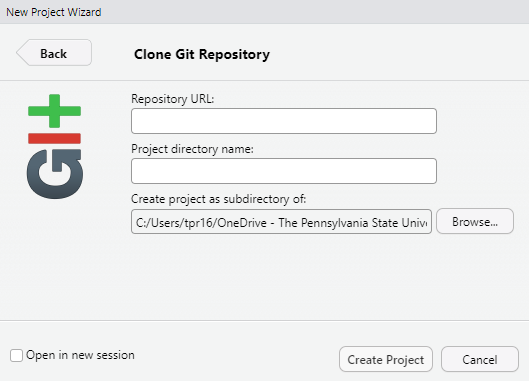


### Task 3: How to "push" local changes to GitHub?
Before you "push" changes to GitHub, you have to "stage" and "commit" the changes. Think of staging as preparing your changes to be pushed to the remote repository. 

1. Click on the “Git” which is present in the upper right window. After clicking the Git button, you will see a list of all files that have been changed since the last commit.

2. Click on the “Staged” checkbox to stage files which you want to push to GitHub and click on the “Commit”.

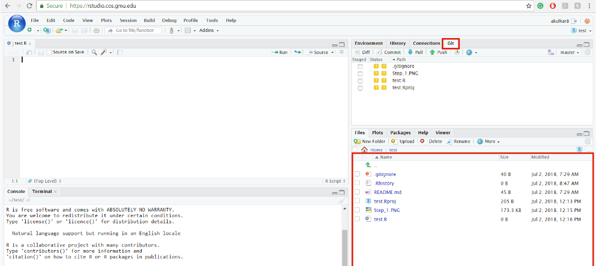

3. A new window will open, and it will reflect you the files which you want to commit to GitHub repository. It is good practice to write a "Commit message". 
4. Finally, click on "Commit". You will see the following screen after clicking on the “Commit” button. Close the window by clicking the “Close” button.

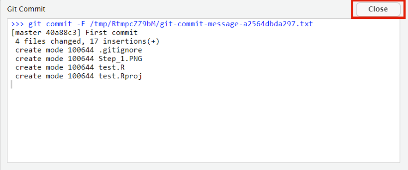

5. Now that we have staged and commited our changes, the final step is to "push" the changes. Click on "Push" in the Git tab to push your changed to GitHub. 

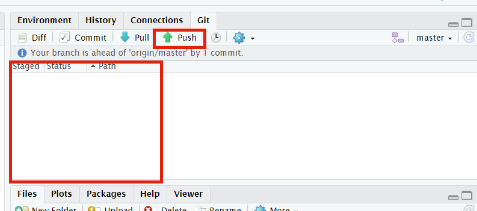


Refresh your GitHub page and check if the remote repository is updated. Sometimes you might be asked for a password. Please provide your PAT token if you are asked for a password.


This introduction should give you an idea of version control with Git works like. This [blogpost](https://aberdeenstudygroup.github.io/studyGroup/lessons/SG-T1-GitHubVersionControl/VersionControl/) provides further details on version control with Git. For instance, we haven't covered how to create pull requests or merge changes. These details are provided in the blogpost. Moreover, we only focused on version control with Git via the RStudio IDE. To learn version control using the terminal (more general), refer to the ["Happy Git and GitHub for the useR"](https://happygitwithr.com/index.html) textbook.

## References:
1. [Version control with Git](https://swcarpentry.github.io/git-novice/01-basics.html) by Software Carpentry.
2. [Version control concepts and best practices](https://homes.cs.washington.edu/~mernst/advice/version-control.html), notes by M Ernst
3. [Happy Git and GitHub for the useR](https://happygitwithr.com/index.html)
4. [About GitHub and Git](https://docs.github.com/en/get-started/start-your-journey/about-github-and-git)
5. [Ch 4 of Introduction to Computational and Data Sciences](https://book.cds101.com/)


