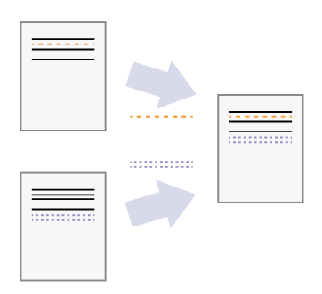
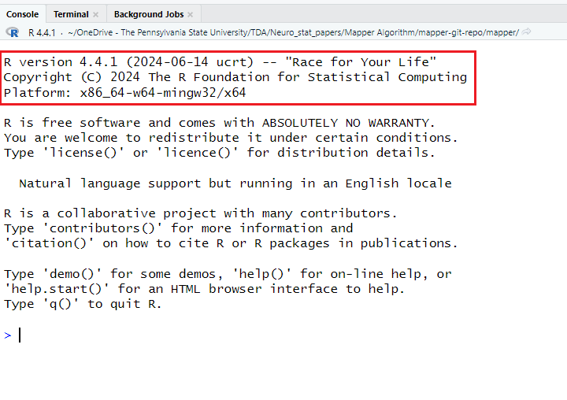
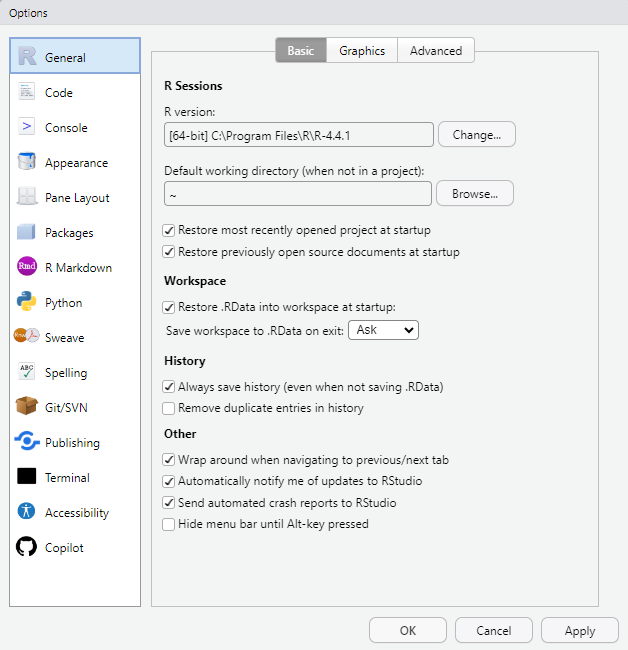

<style type="text/css">
  body{
  font-size: 12pt;
}
</style>

# Version Control

## Introduction


Fig 1: Source - “notFinal.doc” by Jorge Cham, https://www.phdcomics.com

* **Version Control** can be thought of as a recording of your progress: you can rewind to start at the base document and play back each change you made, eventually arriving at one of your more recent versions.
* In other words, we  can "play" the different _versions_ of the document of interest i.e. version control system is a tool that keeps track of our changes, effectively creating different _versions_ of our files.
* Version control is useful, whether you are working alone or in a team.



Fig 2: Let us say that two users make independent sets of changes on the same document. Unless there is a _conflict_, you can incorporate two sets of changes into the same base document.

* A **conflict** is a change made by one user  of version control system that is incompatible with changes made by other users.
* Version control system requests human assistance when two people make conflicting edits.


* Version control allows us to decide which changes will be made to the next version, and keeps useful metadata about them. 
* For any part of a document, you can determine when, why, and by whom it was ever edited.
* Each person edits his or her own copy of the documents and chooses when to share those changes with the rest of the team. Thus, temporary or partial edits by one person do not interfere with another person's work.

### Summary
1. Version control is like an unlimited ‘undo’.
2. Version control also allows many people to work in parallel.

#### Git is a kind of version control system.
Some other examples of version control are Subversion, Mercurial etc. In this class, we focus on Git.

## Repositories and working copies

Version control uses:
- **Repository**: database of all edits or versions of your project.
- **Working copy**: A personal copy of all the files in the project. You can make arbitrary edits to this copy, without affecting your teammates.


* When you are happy with your edits, you **commit** your changes to a repository.
* You can **update** your working copy to incorporate any new edits or versions that have been added to the repository since the last time you updated.
* If different users made edits simultaneously (this is sometimes called **branching**), the the version history splits and then merges again. In the example below, Version 4 is called a *merge*.


## Distributed and centralized Version Control
* There are two types of version control that mainly differ in the number of repositories:
  - Centralized version control: there is one repository
  - Distributed version control: there are multiple repositories.

* Distributed version control is more modern while centralized version control is rarely used these days. Git, the most popular version control, is a distributed version control system.


| Centralized version control | Distributed version control in git |
|:----------------------------|:-----------------------------------|
| Each user gets their own working copy, but there is <br> just one central repository | Each user gets their own repository _and_ working copy.|  
|As soon as you commit, it is possible for your <br> co-workers to update and to see your changes | - After you commit, others have no access to your changes <br> until you push your changes to the central repository <br> - When you update, you do not get others' changes unless  <br> you have first fetched those changes into your local repository|   
|For others to see your changes, two things must happen <br> - You commit <br> - They update| For others to see your changes, four things must happen: <br> - You commit <br> - You push <br> - They fetch <br> - They update  |


# Git and GitHub
* **GitHub** is a cloud-based platform where you can store, share, and work together with others to write code. 
* GitHub is built upon Git. Git is what makes collaborative working possible while using GitHub.
* When you upload files to GitHub, you'll store them in a "Git repository." 
* This means that when you make changes (or "commits") to your files in GitHub, Git will automatically start to track and manage your changes.
* Most people work on their files locally (on their own computer), then continually sync these local changes—and all the related Git data—with the central "remote" repository on GitHub.

There are alternatives to GitHub, like GitLab and Bitbucket, but we will be focusing only on GitHub.


# Initial set-up
- [Register a free GitHub account](https://happygitwithr.com/github-acct#github-acct)
- [Install or upgrade R and RStudio](https://happygitwithr.com/install-r-rstudio#install-r-rstudio)
- [Install Git](https://happygitwithr.com/install-git#install-git)


#### How to update the R version in your RStudio? 

Identify the current R version you are using with the following code:
```{r}
# We can see R version in the console as soon as we start a new R session
# Other option is the command below
R.version.string
```


  * Go to the CRAN website.
    - For Windows Users: https://cran.r-project.org/bin/windows/base/
    - For Mac Users: https://cran.r-project.org/bin/macosx/
  * Download and run the latest R installer. This will update R.
  * Now, open/re-open RStudio.
  * Check if RStudio has detected the updated R version. As soon a new R session starts, you can see R     version information in the console.

  
  * If RStudio doesn't automatically detect the latest R version, do the following: <br>
    Tools >> Global options.
    
 
    
  * Select the appropriate R version in the "R version" section of the right panel using the `change` button.
  * After choosing the appropriate R version, click on "Apply" and then "OK" to complete the process.
  
#### Git installation 

Run the following in your **terminal** (not the usual console) to check if git is already installed. 

```
which git

git --version
```
 

If Git isn't already installed, use 
* Git Bash, if you are a Windows user: https://gitforwindows.org/ <br>
In the future, if you need to update git on your Windows OS, run the following command in the terminal
```
git update-git-for-windows
```
* Install the Xcode command line tools (which includes Git) if you are a Mac user. <br>
Run the following command in terminal to install Xcode

```
xcode-select --install
```

#### Set Git username and email
Run the following R code to set your Git username and email. Another option, which does not involve downloading a package is discussed in the "Happy Git and GitHub for the useR" textbook: https://happygitwithr.com/hello-git.
```
## install.packages("usethis")

library(usethis)
use_git_config(user.name = "Jane Doe", user.email = "jane@example.org")
git_vaccinate()
git_sitrep()
```
**Note:** Mention the email associated with the GitHub account.


#### Communication with GitHub via HTTPS
\textbf{Option 1:}

* GitHub is the remote Git server that we want to communicate with. Moreover, credentials are required in this process to make sure that we are the specific GitHub user who has the access to do the task we are trying to do.
* Git can communicate with a remote server using one of two protocols, HTTPS or SSH, and the different protocols use different credentials.
* Unless there is a specific reason to choose the SSH route, everyone is recommended to follow the credential set up for HTTPS protocol.
* With HTTPS, we will use a **personal access token (PAT)**. 
  - Settings >> Developer settings >> Personal access tokens
  - Before clicking “Generate token”, it is recommended to select the scopes "repo", "user", "gist" and "workflow".
  - Click on "Generate token"
* GitHub encourages the use of perishable tokens, with a default Expiration period of 30 days. GitHub’s security folks probably have good reasons for their recommendation.
* You won’t be able to see this token again, so don’t close or navigate away from this browser window until you store the PAT locally.

\textbf{Option 2:}
Use the R package `usethis`to create a token:
```
usethis::create_github_token()
```
\textbf{NOTE:} For a more detailed description of PAT, see Chapter 9 of textbook "Happy Git and GitHub for the useR". (e-book available on course homepage)


## Communication between the remote server and local computer


## References:
1. [Version control with Git](https://swcarpentry.github.io/git-novice/01-basics.html) by Software Carpentry.
2. [Version control concepts and best practices](https://homes.cs.washington.edu/~mernst/advice/version-control.html), notes by M Ernst
3. [Happy Git and GitHub for the useR](https://happygitwithr.com/index.html)
4. [About GitHub and Git](https://docs.github.com/en/get-started/start-your-journey/about-github-and-git)

