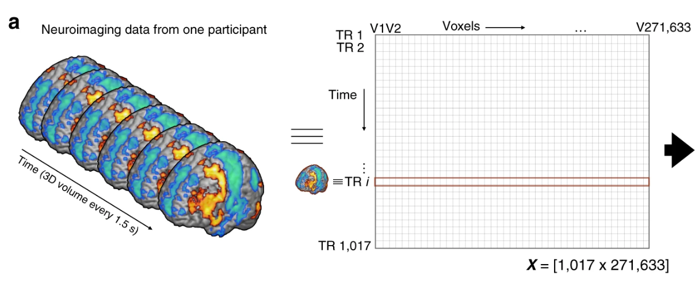

## Midterm and Final Project details
- Midterm will be held in class (10:45 am - 11:45 am) on July 19th.
- Information and practice questions for the midterm are provided under the "Midterm" module.
- Final project details are provided under the "Final project" module.
- I have included a list of publicly available datasets. You can use data from one of these websites or from a different website of your choice.
- Make sure to check how to cite your data source. You must add the citation to your final report. 


## Review of some important concepts

## Three Important Concepts 

1. Data can be usefully organized into tables with "cases" and "variables."  
    - In "tidy data" every case is the same sort of thing (e.g. a person, a car, a year, a country in a year) 
    - We sometimes even modify data in order to change what the cases represent in order to better represent a point.

2. Data graphics and "glyph-ready" data
    - each case corresponds to a "glyph" (mark) on the graph
    - each variable to a graphical attribute of that glyph such as x- or y-position, color, size, length, shape, etc. 
    - same is true for more technical tools (e.g., models, predictions, etc.) 

3. When data are not yet in glyph-ready form, you can transform (i.e. wrangle) them into glyph-ready form.  
    - Such transformations are accomplished by performing one or more of a small set of basic operations on data tables
    - This is the work of data "verbs" 

* So far, all the data sets we have come across have variables like "Age", "Sex", "Income" etc. The experimental unit is usually an individual, group of individuals, a country etc.
* Let us look at a different kind of data - fMRI data. Ignore details like how to read fMRI data into R, what R functions to use etc. 
* The purpose of this example is to look at an interesting new data set and see if we can use the concepts we learnt so far.

### About the dataset
- Data Source: [OpenfMRI, CNP data](https://openfmri.org/dataset/ds000030/)
- The study includes imaging of a 
    - large group of healthy individuals from the community (138 subjects)
    - samples of individuals diagnosed with schizoprenia (58)
    - bipolar disorder (49)
    - and ADHD (45).
- Age group of participants: 21-50
- Participants recruited by community advertisements from the Los Angeles area.
- Participants completed extensive neuropsychogical testing, in addition to fMRI scanning. 
- Participants should have completed at least 8 years of education 
- Participants were screened for neurological disease, history of head injury, use of psychoactive medications, substance dependence within past 6 months, history of major mental illness or ADHD, and current mood or anxiety disorder. 
- ......

This is just a subset of information about the study conducted at UCLA. Check the OpenfMRI website for more information. Let us focus on how the dataset looks like.

```{r include=FALSE}
# source("https://neuroconductor.org/neurocLite.R")
# neuro_install("neurobase", release = "stable")

library(neurobase)
library(oro.nifti)
```

```{r include=FALSE}
fmri_data <- readnii("data/dataset/sub-10159/func/sub-10159_task-bart_bold.nii/sub-10159_task-bart_bold.nii")
```

We are looking at fMRI data associated with just one subject (Subject 10159) while performing some task. We will ignore the exact details of this task for now.
```{r}
fmri_data
```



How does the data look like?
```{r}
orthographic(fmri_data)
```

Let us look at the intensity for one single voxel.
```{r}
fmri_data[20,20,30,1]
```


Let us plot the **time series** data associated with ONE voxel of ONE subject.
```{r}
plot(fmri_data[20,20,30,],type='l', xlab = "Enumerated voxels", ylab = "Intensities")
```

### Discussion quesions
- Assume that the dataset we have is the voxel intensities associated with just one subject. How would tidy data look like?
- What is the glyph in the plot of voxel intensities?
- How does glyph ready data look like?


## Classifying functions
* When data are not yet in glyph-ready form, you can transform (i.e. wrangle) them into glyph-ready form.
* Keep in mind that when we are wrangling, we are carrying out actions thus we will need **data verbs**.
* There are several ways we can classify verbs (functions) for data wrangling. The DC textbook presents one way:
  - Reduction Functions: Any function which takes an input (variable) vector ($n \times 1$) and returns a single value as the output (i.e., a scalar ($1 \times 1$)).
  - Transformation Functions: Any function which takes one or more input variables and returns a new variable.
  - Data Verbs: Functions which act upon a data frame and return a new data frame.
  
Look at the `data-wranglin-activity.Rmd` file posted on Canvas. Perform the necessary data analysis and identify the different data verbs used while data wrangling.

## Interactive graphics
An extremely helpful package is the `esquisse` package. Install the package as usual. 

```{r}
library(esquisse)
# another option is to go to the "Addins" menu
esquisser()
```

Use the [esquisse vignette](https://cran.r-project.org/web/packages/esquisse/vignettes/get-started.html) to understand how `esquisse` interactive graphics work.

Notice that `esquisse` package also provides with the corresponding `ggplot2` syntax required for the graphics.

```{r}
install.packages("palmerpenguins")
library(palmerpenguins)
penguins
```

- Interpret the code below. Comment the code describing what each line is doing. 
- Try to recreate the same bar chart in `esquisse`.

```{r}
library(tidyverse)
library(ggplot2)

penguins %>%
  filter(island != "Torgersen") %>%
  group_by(species) %>%
  arrange(bill_length_mm, .by_group = TRUE) %>%
  ggplot(mapping = aes(x = bill_length_mm, fill = species)) +
  geom_histogram(color = "black",binwidth = 1, closed = "left", na.rm = TRUE) +
  scale_y_continuous(expand = expansion(mult = 0, add = c(0, 5))) +
  theme_bw()
```


