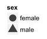

```{r include=FALSE}
library(mosaic)
library(tidyverse)
library(COUNT)
```


## Grammar of Graphics

- Wilkinson's 2005 book *The Grammar of Graphics (2nd Ed.)* provides the principles and philosophy 
    - the `ggplot2` R package implements this framework
    - **Goal**: flexible tools for building rich, intuitive graphics

- Data Visualization is critical to our goals for high quality Exploratory Data Analysis (EDA)
    1. **Examine the data source:** variable types, coding, missingness, summary statistics/plots, who/what/when/where/why/how data were collected
    2. **Discover features that influence may modeling decisions:** investigate potential outliers, consideration for recoding variables (e.g., numeric data that's functionally dichotomous), evaluate correlation structure (e.g., autocorrelation, hierarchy, spatial/temporal proximity)
    3. **Address research questions:** build intuition and note preliminary observations/conclusions related to each research question.  Also, note observations that prompt you to refine your research questions or add new questions to investigate


## Glyphs and Data

In archaeology, a GLYPH is a symbol or "mark" used to impart meaning:

HeiroGLYPH | Mayan GLYPH
---------------|----------------:
 |  

## Data Glyph


### A data glyph is also a "mark" on a graph, e.g. 

               

The features of a data glyph encodes the value of variables. 

- Some are very simple, e.g. a dot: 
- Some combine different elements, e.g. a pointrange: 
- Some are complicated, e.g. a dotplot: 

See: *<https://ggplot2.tidyverse.org/reference/>*


## Some Graphics Components

#### **glyph**

- The basic graphical unit often corresponding to one case.
- Other terms used include *mark* and *symbol*. 

#### **aesthetic**

- a visual property of a glyph such as position, size, shape, color, etc.  
- may be **mapped** based on data values: `color -> sex` 
- may be **set** to particular non-data related values: `color is black`

#### **scale**

#### The relationship between the variable value and the value of the aesthetic the variable is mapped to.

* Diastolic Blood Pressure (bpd) has units of mmHg (millimeters of mercury)
* Weight is measured in kg

The conversion from SBP to position is a *scale*.

* Smoker is "never", "former", "current"
* Color is red, green, blue, ...

The conversion from Smoker to color is a *scale*.

#### **frame**

- The position scale describing how data are mapped to the coordinate system in use
- Quite often, the frame defines the x-axis and y-axis of a 2-dimensional cartesian plane


#### **Guides**

#### Guide: an indication to a human viewer of what the scale is.

* Axis ticks and numbers


* Legends

 
 


* Labels on faceted graphics


#### Example 1

Can you determine all the components on the following graph?

```{r}
#?mtcars
data("mtcars")

mtcars %>%
  ggplot() + 
  geom_point(aes(x = hp, 
                 y = mpg, 
                 color = as.factor(carb), 
                 shape = as.factor(gear))) +
  facet_grid(~vs, 
             labeller = labeller(vs = c("0" = "V-Shaped", 
                                        "1" = "Straight"))) +
  ggtitle("Example Plot from `mtcars` Data") + 
  xlab("Gross Horsepower") + 
  ylab("Miles per Gallon") +
  scale_shape_discrete(name = "Number of Forward Gears") +
  scale_color_discrete(name = "Number of Carburetors")

```

## Glyph-Ready Data

Glyph-ready data has this form:

  * There is one row for each glyph to be drawn. 
  * The variables in that row are mapped to aesthetics of the glyph (including position)
  * Glyph-ready data is often, but not not always, tidy data. But `tidyverse` makes it is very easy to go between the two!


## Designing Graphics

Graphics are designed by the human expert (you!) in order to reveal information that's present in the data.

#### Design choices


* What kind of glyph, e.g. scatter, density, bar, ... many others
* What variables constitute the frame. And some details:
    - axis limits
    - logarithmic axes, etc.
* What variables should be mapped to other aesthetics of the glyph.
* Whether to facet and with what variable.

More details, ..., e.g. setting of aesthetics to constants


## Good and Bad Graphics

Remember ... 

> Graphics are designed by the human expert (you!) in order to reveal information that's present in the data.

- choices depend on what information you want to convey.
- practice reading graphics and critique which ways of arranging thing are better or worse.
- A basic principle is that a graphic is about *comparison*.  Good graphics: 
    - make it easy for people to perceive things that are similar and things that are different.  
    - put the things to be compared in proximity to one another (e.g., "side-by-side") 


## Perception and Comparison

In roughly descending order of human ability to compare nearby objects:

1. Position
2. Length
3. Area
4. Angle
5. Shape (but only a very few different shapes)
6. Color

Color is the most difficult...    

  - color gradients --- we're better at
  - discrete colors --- must be carefully selected.
  - lots of people are color blind ([1 in 12 men; 1 in 200 women](http://www.colourblindawareness.org/))
  
For more, see:

Cleveland W. (1985). *The elements of graphing data*. Bell Telephone Laboratories: Murray Hill, NJ.


#### Last class, we focused primarily on two geometric objects: geom_point and geom_smooth. However, there are multiple other geometric object options in `ggplot2` package.
* `geom_point()`
* `geom_bar()`
* `geom_boxplot()`
* `geom_density()`
* `geom_vline()`
* `geom_segment()`
* `geom_histogram()`
* and many more...

```{r}
ggplot(data = iris , aes(x = Petal.Width)) +
  geom_histogram(bins = 15) 
```

  * What are the glyphs, aesthetics, guides, etc. for this plot?
  * How is the data for this plot related to the "raw" data?
  


#### Example 2

<https://github.com/rfordatascience/tidytuesday/tree/master/data/2020/2020-12-22>

```{r message=FALSE}
# These data are available from the `tidytuesdayR` package 
# Install package from CRAN via: install.packages("tidytuesdayR")

library(tidytuesdayR)

TidyTuesData <- tidytuesdayR::tt_load(2020, week = 52)
BigMac <- TidyTuesData[["big-mac"]]

```


#### Big Mac Price vs GPD per Capita?

* Try using the `esquisse` package to explore the data! 
* We will look at each of our plots and try to understand the information the plot is providing.

In the console: 

`esquisser(BigMac)`


```{r}
library(esquisse)

# use `esquisser( )` to draft a plot and then generate R code to put here!

```


#### Here's an example:

```{r}
ggplot(BigMac) +
 aes(x = gdp_dollar, y = dollar_price) +
 geom_point(size = 1L, colour = "#0c4c8a") +
 labs(title = "Big Mac Price Around the World vs GDP per Capita") +
 theme_minimal()
```

- Using the graph, what can you say about the following?
  - Frame  
  - Glyph
  - Aesthetic
  - Scale
  - Guide
  - Facet


#### Go to more-ggplot2.Rmd file under the "R Scripts" module. We will work on an in-class activity to get more comfortable with `ggplot2`.


