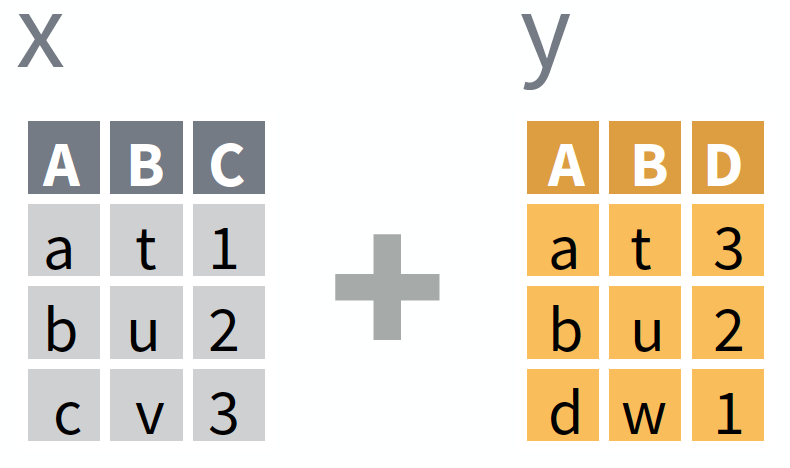
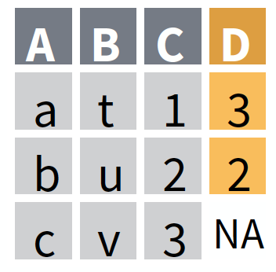
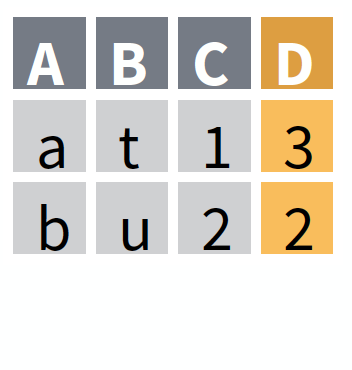
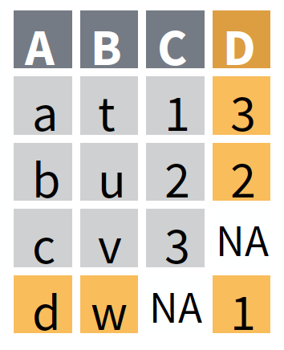
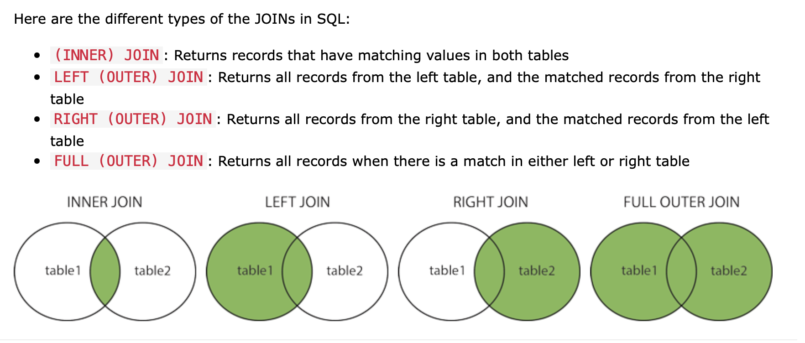

## Important announcements
* Midterm will be held in class (10:45 am - 11:45 am) on July 19th. 
* Information and practice questions for the midterm are provided under the “Midterm” module.
* **Please come to class in time on Friday.**
* Final project details are provided under the “Final project” module.
* Start looking at what you would like to work on for the final project. The final topic submission is due 25 July at 11:59 pm

```{r include=FALSE}
library(dcData)
library(ggplot2)
library(tidyverse)
```

## Motivation
Let us start with an example from the DC textbook. We will focus on two datasets in the `dcData` package - `CountryData` and `CountryCentroids`.

```{r}
data("CountryData")
CountryData_sub = CountryData[,1:9]
head(CountryData_sub)
names(CountryData_sub)
```

```{r}
dim(CountryData_sub)
```

```{r}
data("MigrationFlows")
MigrationFlows2000 = MigrationFlows[,1:4]
head(MigrationFlows2000)
```

```{r}
dim(MigrationFlows2000)
```


* Suppose we are interested in these data is to understand the forces that shape migration. In that case, it is a good idea to join information about the "origin" country to the migration data.

* To do this, you’ll have to match the `origincode` variable in `MigrationFlows2000` to the `country` variable in `CountryData_sub`.

* This leads to the next problem - how do we match the elements of the column `origincode` to that of `country` when their representation of countries is different. <br>
Eg. AUS $\equiv$ Australia

* So we need to find or construct a data frame that contains the translation from country code to country name. 

```{r}
head(CountryCentroids)
```


```{r}
JoinedData1 <-
CountryCentroids %>%
  select(name, iso_a3) %>% 
  left_join(CountryData_sub, by = c("name" = "country")) 

JoinedData1
```


* Note that the by argument to `left_join()` specifies that the case matching is to be accomplished by comparing the `name` variable in the Left table to the `country` variable in the Right table.


General syntax
```
LeftTable %>% 
  joinOperation(RightTable, vars_for_matching)
```

* Now  we can join the `JoinedData1` data to the `MigrationFlows2000` data.

Which variables do we match now?
```{r}
head(JoinedData1)
```
```{r}
head(MigrationFlows2000)
```

* Left Table = `MigrationFlows2000`
* Right Table = `JoinedData1`

```{r}
MigrationFlows2000 %>%
  left_join(JoinedData1, by = c("origincode" = "iso_a3")) 
```

* Left Table =  `JoinedData1`
* Right Table = `MigrationFlows2000`

```{r}
JoinedData1 %>%
  right_join(MigrationFlows2000, by = c("iso_a3" = "origincode"))
```

* This is an example of a **Natural Join**
* Natural Join: The selection of variables that match the cases in one table to another based simply on variables with the same name that appear in both tables.
* In these situations, you can explicity identify the corresponding variables with the `by` argument


## Summary

#### Today, we will discuss the "join" data verb that take two tables as input and produce a single table as output. 
* Such operations enable you to combine information from different tables. With these two-table verbs, you can construct data-wrangling processes that combine many data frames.

#### A **match** must be made between corresponding rows of the tables `CountryData_sub` and `MigrationFlows2000` while **joining** the two tables to construct a glyph-ready data. Note that these matched rows can belong to different row positions of the two tables. 

* To **join** is a data verb that finds matching rows in each of two data frames and constructs an output that combines the data from the two tables accordingly.
* Conventionally, the two tables are referred to as the **left** and the **right** table.
* A **match** is defined in terms of one or more variables that appear in both the Left and the Right tables.


## Types of Joins

## Establishing a match between cases

A match between a case in the *left* table and a case in the *right* table is made based on the values in pairs of corresponding variables.

- **You** specify which pairs to use.
- A pair is a variable from the left table and a variable from the right table.
- Fine to specify several variables for matching
    - e.g., `by = c("A" = "var1", "B" = "var2")` 
    - matches `A` & `B` from left table to `var1` and `var2` from right table
- Cases must have *exactly equal* values in the left variable and right variable for a match to be made.
  - A & B and A & B are a match 
  - A & B and A & C are not a match 
  - A & B and B & A are not a match 
- If you **don't** specify the variables directly
    - The default value of `by = ` is all variables with the same names in both tables  
    - This is **not reliable** in general unless you've checked 

## Basic join types 

*Note: Images adapted from RStudio Data Transformation Cheat Sheet*
<https://rstudio.com/resources/cheatsheets/>


* What to do when there is **no match** between a left case and any right case?
* What to do when there are **multiple matching cases** in the right table for a case in the left table?

Different kinds of join have different answers to these questions.





## Basic join types 

*Note: Images adapted from RStudio Data Transformation Cheat Sheet*
<https://rstudio.com/resources/cheatsheets/>


- `left_join()`: joins matching rows from the *right* table to the *left* table
  - i.e. we keep ALL information from the left table, and add information from the right table
- `inner_join()`: only retain rows for which a match exists
  - i.e. we keep only infomrmation that has a link ID on BOTH tables

<br>

| Left Join                               | Inner Join                       |
|:----------------------------------------|:---------------------------------|
|                        |                |
| *result:* all LEFT table cases          | *result:* only cases matched in BOTH tables  |
| `X %>% left_join(Y)`                    | `X %>% inner_join(Y)`            |
| `left_join(X, Y)`                       | `inner_join(X, Y)`               |


<br>

### IF no right cases match the left case...

- `left_join()`: Keep the left case and fill in the new variables (from the right table) with `NA`
  - i.e. keep every unique combination in both tables
- `inner_join()`: Discard the left case.
  - i.e. get rid of everything that does not have a match in both tables

<br>

### IF multiple right cases match the left case...

`left_join()` and `inner_join()` do the same thing:

* `left_join()`: Keep **all combinations**.
* `inner_join()`: Keep **all combinations**.

<br>

## Other useful joins that sometimes come up:
*Note: Images adapted from RStudio Data Transformation Cheat Sheet*
<https://rstudio.com/resources/cheatsheets/>

<br>

* `full_join()` Keep left case as well as unmatched right cases.
* `right_join(X, Y)` is the same as `left_join(Y, X)`
* Filtering or exploratory joins (See RStudio Cheat Sheet)
    - `semi_join()` Show left cases with a match in the right table (e.g., what WILL be joined)
    - `anti_join()` Discard left cases with a match in the right table (e.g., what will NOT be joined)

<br>


<br>


| Full Join              |
|:-----------------------|
|       |
| *result:* ALL cases, EITHER table  |  
|  `X %>% full_join(Y)`          |
|  `full_join(X, Y)`             |


## Other resources 



A website I find very helpful: <https://statisticsglobe.com/r-dplyr-join-inner-left-right-full-semi-anti>. 

