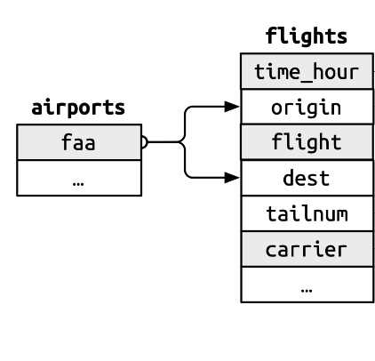

## Today's plan

* More about joining dataframes (continuation of L10)

* Wide and narrow data organization

* Lecture notes are based on the R4DS textbook.

## Joining Data Frames

### Review of L10
* **Join** is a data verb that take two tables as input and produce a single table as output.
* Such operations enable us to combine information from different tables.
* Conventionally, the two tables involved are referred to as the **left** and the **right table**.
* How do we join the two tables? - by **matching** corresponding rows of the two tables. Note that these matched rows can belong to different row positions of the two tables.

```{r include=FALSE}
library(tidyverse)
library(nycflights13)
```

### Keys
* **Keys** are the variables used to connect a pair of data frames in a join. 
* We will try to understand more about keys using example data sets from the `nycflights13` package.


#### Example 1: Understanding Primary keys, Compound keys and Foreign keys

* A **primary key** is a variable that uniquely identifies each observation.

* `airports` dataset provides identification codes for different airports.

* What do you think is the primary key in the `airports` dataset?

```{r}
data("airports")
head(airports)
```

* `flights` dataset provides arrival and departure information about flights at three airports in New York: JFK, LGA, EWR.

* Is one variable sufficient to uniquely identify each case?

```{r}
data("flights")
head(flights)
```

```{r echo=FALSE}
head(flights)
```

* If a set of variables ($> 1$) uniquely identify the case of a dataset, then these variables form a **compound key**.

* What do you think is the compound key for the `flights` dataset?

* A **foreign key** is a variable (or set of variables) that corresponds to a primary key in another table.

* Mention a primary key-foreign key pair for this example.




#### Practice question

Identify primary-foreign key pair.

Dataset 1:
```{r}
head(airlines)
```

Dataset 2:
```{r}
head(flights)
```

### Surrogate Keys

* Surrogate keys can be particularly useful when communicating to other humans: it’s much easier to tell someone to take a look at flight 2001 than to say look at UA430 which departed 9am 2013-01-03.

```{r}
flights2 <- flights %>%
  mutate(id = row_number(), .before = 1)

flights2
```

#### Summary: Dataframes are connected via keys.


### Mutating and Filtering Joins
* The joins we discussed last class are called **Basic joins** and are available in `dplyr` package.


* **Mutating Joins:** it first matches observations by their keys, then copies across variables from one data frame to the other. 

    * Like `mutate()` function, the join functions add variables. Eg. `left_join()`

    * What are some other mutating joins?

* **Filtering joins**, like the `filter()` function, it filters rows. E.g. `semi_join()`

    * What is another example of filtering join?

## Back to Tidy Data: Wide and Narrow Data formats


* While looking at tidy and messy data examples, we worked with two datasets - `relig_income` and `fish_encounters`.

#### `relig_income`
* This dataset explores the relationship between income and religion in the US. It comes from a report produced by the Pew Research Center, an American think-tank.

* Format 1
```{r}
relig_income
```

- The data in **wide** format has
    - separate variables for each level in `key`
    - sets the values for those variables from the info in `value`
    
    
| ID      | Key_level_1 | Key_level_2 | ....|
| ----------- | ----------- | ----------- | ---|
| ID1      | value(1,1)      | value(1,2)       |....|
| ID2      | value(2,1)      | value(2,2)       |....|
| ... | ... | ... | 


#### `pivot_longer()`
* To pivot means to turn or rotate, like a hinge. (Source: Vocabulary.com)
* `pivot_longer()` makes datasets longer by increasing the number of rows and decreasing the number of columns.

* Format 2
```{r}
relig_income %>%            # dataset we want to reshape
  pivot_longer(             # we want to inc rows and dec cols
    cols = !religion,       # which cols to reshape
    names_to = "income",    # name of the var under which above col names will go
    values_to = "count"     # name of the variable for cell values
  )
```

- Data in Key/Value format is **narrow**
    
| ID      | Key | Value |
| ----------- | ----------- | ----------- |
| ID1      | Key_level_1       | value(1,1)      |
| ID1      | Key_level_2       | value(1,2)      |
| ... | ... | ... | 
| ID2      | Key_level_1       | value(2,1)      |
| ID2      | Key_level_2       | value(2,2)     |
| ... | ... | ... | 


#### `fish_encounters`

* The `fish_encounters` dataset describes when fish swimming down a river are detected by automatic monitoring stations.

* Format 1

```{r}
fish_encounters
```

* Format 2
```{r}
fish_encounters %>%            # dataset we want to reshape
  pivot_wider(                 # we want to dec rows and inc cols
    names_from = station,      # mention the col we want to use to "widen" data
    values_from = seen         # values to fill in the cells
  )
```


