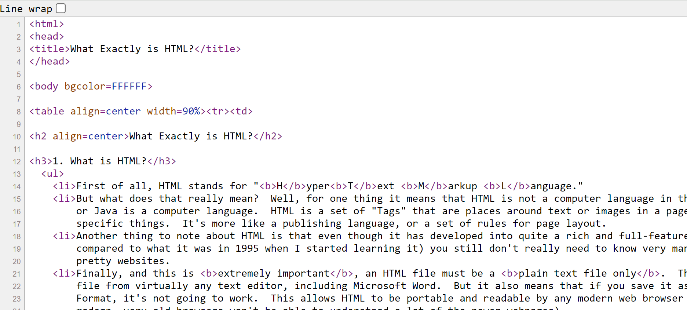

* Web scraping is a very useful tool for extracting data from web pages.

* The R package we will be using: `rvest`

```{r}
# for data scrapping
library(rvest)

# tools to work with scrapped data
library(tidyverse)
```

## HTML basics

A useful reference: [What Exactly is HTML?](https://web.ics.purdue.edu/~gchopra/class/public/pages/webdesign/02_whatishtml.html). I have used these notes to prepare lecture notes for this section.

* **H**yper**T**ext **M**arkup **L**anguage (HTML) is the language that describes web pages.

* HTML is a set of "Tags" that are places around text or images in a page, to make the text or image do specific things. It's more like a publishing language, or a set of rules for page layout.

* In operational terms, a tag is anything that appears between the symbols $<$ and $>$. For example, to define a piece of text in a paragraph, you would enclose it within the "paragraph tag".
    
    `<p>` Text goes here! `</p>`
    
As you can see, the paragraph tag actually consists of two tags, one to start the markup section, and one to end it. 

* We can look at the source page for each website. Source page associated with [this website](https://web.ics.purdue.edu/~gchopra/class/public/pages/webdesign/02_whatishtml.html) is shown below.



* Tags can come with additional optional attributes that let you specify things about style ot formatting.

    `<p align=center>` Text goes here! `</p>`

* Note that for most tags, you have a beginning tag and an ending tag to function properly.


#### Summary

* HTML has a **hierarchical structure** formed by elements which consist of a start tag, optional attributes (id='first'), an end tag, and contents (everything in between the start and end tag).


### More about HTML Tags
* The entire HTML page is enclosed in `<html></html>`.

* Within this, there are two main sections:
  * `<head></head>`: contains information you don't want the browser to see.
  * `<body></body>`: contains the main portion of HTML and things you want the surfer to see.
    * Some optional attributes for the `body` tag: `<body bgcolor=FFFFFF>` and `<body background=coolpicture.jpg>`.

| Tag type          | Tag                | Attributes and other info                       |
| :---------------- | :----------------- | :---------------------------------------------- |
| Paragraph         |   `<p>text</p>`    | `align=center/left/right` |
| Heading           | `<h1>Text</h1>` <br> ... <br> `<h6>text</h6>`   | `align=center/left/right` |
| Lists    |  Ordered Lists `<ol></ol>` <br> Unordered Lists `<ul></ul>`  | **No** attribute, requires another tag <br> Requires list element tag `<li>` |
|Links              | `<a></a>`         | **Always** requires the attribute `href` <br> `<a href= url>text</a>`|
|Title of the page  | `<title></title>` | A tag nested within the `<head></head>` tag |


#### Note
Use `<li>` to start off each element in the list. This is a tag that typically does not require a closing tag, as closing is implied by either a new `<li>` element, or a list closing element i.e. `</ol>` or `</ul>`.

* List of different tags are available at [this website](https://www.werbach.com/barebones/barebones.html).

* Typically all of your text should be embedded in some kind of tag, either a paragraph, header or list item.

* Since $<$ and $>$ are used for start and end tags, you can’t write them directly. Instead you have to use the HTML escapes `&gt`; (greater than) and `&lt`; (less than).

* Block tags vs inline tags:
  * Block tag examples: `<h1>` (heading 1), `<section>` (section), `<p>` (paragraph), `<ol>` (ordered list)
  * inline tag examples: `<b>` (bold), `<i>` (italics), `<a>` (link) format text inside block tags.
  
* A resource suggested by R4DS textbook: https://developer.mozilla.org/en-US/docs/Web/HTML

* There are a wide range of possible HTML escapes but you don’t need to worry about them too much because `rvest` automatically handles them for you.

* Web scraping is possible because most pages that contain data that you want to scrape generally have a consistent structure.

## Extracting Data

* To get started scraping, you’ll need the URL of the page you want to scrape.

* You’ll then need to read the HTML for that page into R with `read_html()`. This returns an `xml_document` object which you will then manipulate using `rvest` package functions.

```{r}
html <- read_html("https://rvest.tidyverse.org/")
html
```

```{r}
class(html)
```


* `rvest` also includes a function that lets you write HTML inline.

```{r}
html_eg <- minimal_html("
  <p>This is a paragraph</p>
  <ul>
    <li>This is a bulleted list</li>
  </ul>
")
```

* We will first learn about the CSS selectors that allow us to identify the _elements/tags_ of interest and then we will look at `rvest` functions that can be used to extract data. 

* Let us start with an example. Notice that the code below has two attributes: `id` and `class`
  * `id` attribute provides a unique identifier for the `<p>` element.
  * `class` attribute targets multiple elements within the same class and applies the same styling. Note that we can define `class` attribute to all tags.
  
```{r}
html_eg <- minimal_html("
  <h1>This is a heading</h1>
  <p id='first'>This is a paragraph</p>
  <p class='important'>This is an important paragraph</p>
")
```

* CSS is short for cascading style sheets. CSS is used to style HTML elements on web pages. It defines how elements are displayed, including layout, colors, fonts, and other properties.

* CSS selectors define patterns for locating HTML elements


```{r}
# selects all <p> elements
html_eg |> html_elements("p")
```

```{r}
# selects all elements with “important” as their class attribute
html_eg |> html_elements(".important")
```

```{r}
# selects the element with the id attribute that equals “first”
html_eg |> html_elements("#first")
```

#### `html_element()` vs `html_elements()`

`html_element()`: when applied to whole document will return the first match.

```{r}
html_eg |> html_element("p")
```

Consider a selector that doesn’t match any elements in `html_eg`:

```{r}
# returns a vector of length 0
html_eg |> html_elements("b")
```


```{r}
# returns NA
html_eg |> html_element("b")
```

* Typically, we use `html_elements()` to identify elements that will become observations and then use `html_element()` to find elements that will become variables. 

```{r}
# Can you mention the elements of html_eg2
html_eg2 <- minimal_html("
  <ul>
    <li><b>C-3PO</b> is a <i>droid</i> that weighs <span class='weight'>167 kg</span></li>
    <li><b>R4-P17</b> is a <i>droid</i></li>
    <li><b>R2-D2</b> is a <i>droid</i> that weighs <span class='weight'>96 kg</span></li>
    <li><b>Yoda</b> weighs <span class='weight'>66 kg</span></li>
  </ul>
  ")
```


#### Using `html_elements()`

```{r}
html_list_elements <- html_eg2 |> html_elements("li")

# the output behaves like a vector
html_list_elements
```

```{r}
class(html_list_elements); length(html_list_elements)
```

```{r}
html_list_elements[2]
```

#### Using `html_element()`
```{r}
html_list_element <- html_eg2 |> html_element("li")

# the output includes just the first list item
html_list_element
```

```{r}
# the output does not behave like a vector
html_list_element[1]
```

Now let us use the `html_element()` function on `html_list_elements` object. We will see that the distinction between `html_element()` and `html_elements()` isn’t important for "name" (within `<b>` tag), but it is important for "weight".

```{r}
html_list_elements
```

When we are trying to extract names, there is no difference between using functions `html_element()` and `html_elements()`.

```{r}
# extract name of each character
html_list_elements |> html_element("b")
```

```{r}
html_list_elements |> html_elements("b")
```

Let us see if the same holds for weights.
```{r}
# selects all elements with “weight” as their class attribute
html_list_elements |> html_element(".weight")
```

Here, we lose the connection between names and weights.
```{r}
# selects all elements with “weight” as their class attribute
html_list_elements |> html_elements(".weight")
```

### Reading tables

Assume that we want to scrape data from a website that already has data in an html table. The function `html_table()` in the `rvest` package can read such data into R.
```{r}
htmltable <- minimal_html("
  <table class='mytable'>
    <tr><th>x</th>   <th>y</th></tr>
    <tr><td>1.5</td> <td>2.7</td></tr>
    <tr><td>4.9</td> <td>1.3</td></tr>
    <tr><td>7.2</td> <td>8.1</td></tr>
  </table>
  ")

```

It returns a list containing one tibble for each table found on the page. Use `html_element()` to identify the table you want to extract.

```{r}
htmltable |> 
  html_element(".mytable") |> 
  html_table()
```


